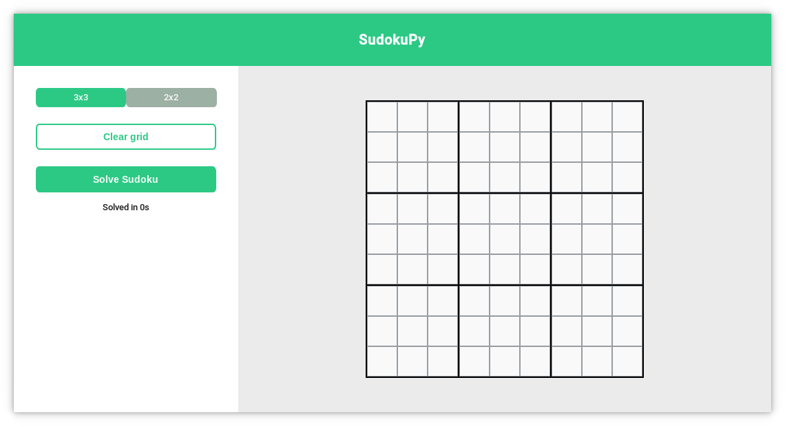

# SudokuPy

> :construction: **This project is currently under development, so there may be bugs, and for the moment it is not functional.**

SudokuPy is a program that solves Sudoku grids using a [DPLL algorithm](https://en.wikipedia.org/wiki/DPLL_algorithm) with propositional logic formulas.


## Installation

Clone the repository.

```
git clone https://github.com/thomas-souchet/SudokuPy.git
```

You need to install the [customtkinter package](https://pypi.org/project/customtkinter/0.3/).

```
pip install customtkinter
```

Run the project.

```
python3 SudokuPy.py
```


## Screenshots


